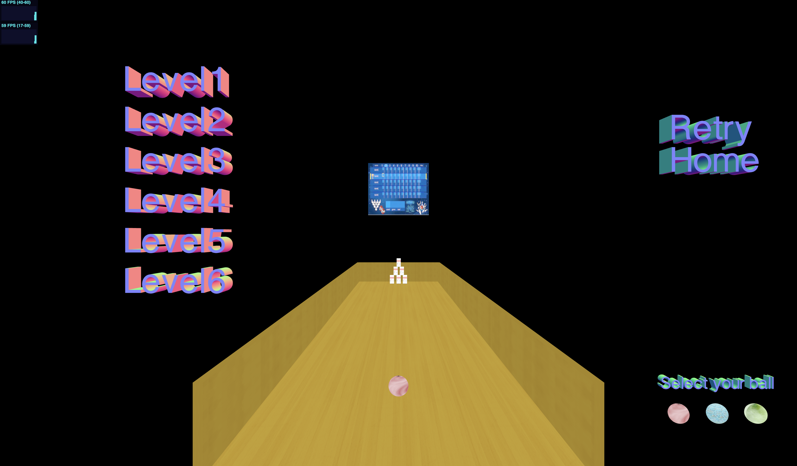

# Hit the target 
The game that we are developing is a first person action game,consists of three different game modes, each with their own difficulties and their own goals to achieve. In general, the common goal is to hit the target correctly. 

  

    
    
    

 

## The project
The main purpose of the user is to hit the target. Analyzing each available game scene one by one, we have for each a different objective, different models, different backgrounds. In particular, in the first scene the intention was to simulate the shooting range, by inserting for each level (reachable with an accuracy defined a priori) different obstacles, such as trees and ducks, which make the game more difficult. In the second scene, on the other hand, no levels have been set up but the user has the possibility to use a game screen completely different from the first. In the third and last scene, we wanted to simulate the game of bowling, making it special thanks to the addition of different levels, each with a different number and arrangement of obstacles on the path.

## Commands
In order to play all three games, simply use the mouse to hit the target (first and second scene) or load the ball (third scene). In general, it is possible to return to the home (from the first and second scenes) by pressing the H key on the keyboard. The management of the lights is facilitated by the menu present during the game screen.

## Authors
* Ludovico Ottobre 1712005 ottobre.1712005@studenti.uniroma1.it
* Gianmarco Evangelista 1711818 evangelista.1711818@studenti.uniroma1.it

## Play the game
Go to this link to play the game: https://sapienzainteractivegraphicscourse.github.io/final-project-gl-project/
